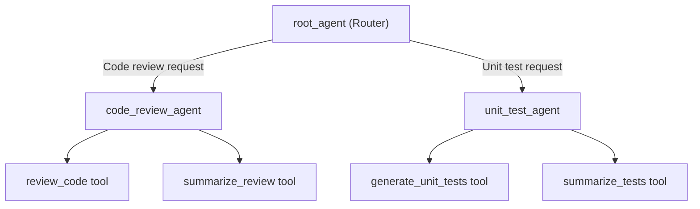

# Multi-Skill ADK Agent for Code Review & Unit Test Generation

Build a Google ADK agent web app with two skills — **Code Review** and **Unit Test Generation** — that demonstrates how a multi-skill agent architecture works. The app runs via `adk web . --port 8001` and shows step-by-step summaries for each turn.

## Proposed Architecture

The agent uses the **Google ADK** (`google-adk`) framework with an `LlmAgent` root agent that routes to two specialized sub-agents based on user intent. Each sub-agent has its own system instructions and placeholder tools that demonstrate the skill pattern.



## Proposed Changes

### Project Structure

```text
class-02-multiskills/
├── multiskill_agent/            # ADK agent package
│   ├── __init__.py              # Package init (from . import agent)
│   ├── agent.py                 # Root agent + sub-agents + tools
│   └── .env                     # API key config
├── skills/                      # Skill definitions (SKILL.md format)
│   ├── code-review/
│   │   └── SKILL.md             # Code review skill instructions
│   └── unit-test-generator/
│       └── SKILL.md             # Unit test skill instructions
└── README.md                    # How to run the app
```

---

### Agent Package (`multiskill_agent/`)

#### [NEW] [`__init__.py`](file:///home/pi-net/Documents/agent_eng_labs/agent_engineering/my-work/class-02-multiskills/multiskill_agent/__init__.py)
- Standard ADK package init: `from . import agent`

#### [NEW] [`.env`](file:///home/pi-net/Documents/agent_eng_labs/agent_engineering/my-work/class-02-multiskills/multiskill_agent/.env)
- `GOOGLE_GENAI_USE_VERTEXAI=FALSE`
- `GOOGLE_API_KEY=your-api-key-here`

#### [NEW] [`agent.py`](file:///home/pi-net/Documents/agent_eng_labs/agent_engineering/my-work/class-02-multiskills/multiskill_agent/agent.py)

This is the core file. It defines:

1. **Placeholder tool functions** — Each skill has two tools:
   - `review_code(code: str) -> str` — Accepts code, returns a placeholder review summary
   - `summarize_review(review_text: str) -> str` — Summarizes review findings
   - `generate_unit_tests(code: str) -> str` — Accepts code, returns placeholder test stubs
   - `summarize_tests(test_code: str) -> str` — Summarizes generated tests

2. **Sub-agents** — Two `LlmAgent` instances:
   - `code_review_agent` — System instructions for code review, equipped with `review_code` and `summarize_review` tools
   - `unit_test_agent` — System instructions for test generation, equipped with `generate_unit_tests` and `summarize_tests` tools

3. **Root agent** — An `LlmAgent` named `root_agent` that:
   - Routes to the appropriate sub-agent via the `sub_agents` parameter
   - Has system instructions that tell it to identify the user's intent (code review vs. unit testing), delegate to the right sub-agent, and summarize each turn's steps

> [!IMPORTANT]
> The tools are **placeholders** — they return hardcoded strings demonstrating the pattern. They don't actually analyze code or generate tests yet.

---

### Skills Directory (`skills/`)

#### [NEW] [`skills/code-review/SKILL.md`](file:///home/pi-net/Documents/agent_eng_labs/agent_engineering/my-work/class-02-multiskills/skills/code-review/SKILL.md)
- YAML frontmatter with `name: code-review` and description
- Instructions for the code review workflow (placeholder steps)

#### [NEW] [`skills/unit-test-generator/SKILL.md`](file:///home/pi-net/Documents/agent_eng_labs/agent_engineering/my-work/class-02-multiskills/skills/unit-test-generator/SKILL.md)
- YAML frontmatter with `name: unit-test-generator` and description
- Instructions for the unit test generation workflow (placeholder steps)

---

### Documentation

#### [NEW] [`README.md`](file:///home/pi-net/Documents/agent_eng_labs/agent_engineering/my-work/class-02-multiskills/README.md)
- Project overview, architecture diagram, setup instructions
- How to run: `adk web . --port 8001` from the `class-02-multiskills` directory

## How It Demonstrates Multi-Skill Architecture

| Concept | How It's Shown |
|---|---|
| **Skill Routing** | Root agent reads user intent and delegates to the correct sub-agent |
| **Tool Functions** | Each sub-agent has specialized tools (placeholder) for its domain |
| **Step Summaries** | System instructions tell each agent to summarize its steps and findings at each turn |
| **SKILL.md Format** | Skills follow the standard Agent Skills spec with frontmatter |
| **ADK Web UI** | `adk web . --port 8001` launches the dev UI for interactive testing and trace inspection |

## Verification Plan

### Automated
```bash
# Install dependencies
pip install google-adk

# Launch the ADK dev UI
cd /home/pi-net/Documents/agent_eng_labs/agent_engineering/my-work/class-02-multiskills
adk web . --port 8001
```

### Manual Verification
- Open `http://localhost:8001` in browser
- Select `multiskill_agent` from the agent dropdown
- Test code review: send "Review this code: `def add(a, b): return a + b`"
- Test unit tests: send "Generate unit tests for: `def multiply(x, y): return x * y`"
- Verify the agent routes correctly, calls placeholder tools, and summarizes each step
