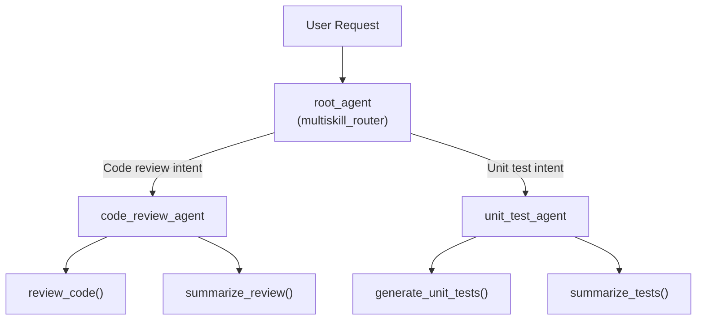

# Walkthrough — Multi-Skill ADK Agent

## What Was Built

A Google ADK agent web app with a **root router agent** that delegates to two specialized sub-agents:

| Sub-Agent | Purpose | Tools |
|-----------|---------|-------|
| `code_review_agent` | Reviews code for issues & best practices | `review_code`, `summarize_review` |
| `unit_test_agent` | Generates unit test stubs | `generate_unit_tests`, `summarize_tests` |

All tools are **placeholders** that return structured demo data to demonstrate the multi-skill pattern.

## Files Created

| File | Purpose |
|------|---------|
| [`multiskill_agent/__init__.py`](file:///home/pi-net/Documents/agent_eng_labs/agent_engineering/my-work/class-02-multiskills/multiskill_agent/__init__.py) | Package init — `from . import agent` |
| [`multiskill_agent/.env`](file:///home/pi-net/Documents/agent_eng_labs/agent_engineering/my-work/class-02-multiskills/multiskill_agent/.env) | API key config |
| [`multiskill_agent/agent.py`](file:///home/pi-net/Documents/agent_eng_labs/agent_engineering/my-work/class-02-multiskills/multiskill_agent/agent.py) | Root agent + 2 sub-agents + dynamic tool imports |
| [`skills/code-review/SKILL.md`](file:///home/pi-net/Documents/agent_eng_labs/agent_engineering/my-work/class-02-multiskills/skills/code-review/SKILL.md) | Code review skill spec linking to scripts and resources |
| [`skills/code-review/scripts/review_code.py`](file:///home/pi-net/Documents/agent_eng_labs/agent_engineering/my-work/class-02-multiskills/skills/code-review/scripts/review_code.py) | Python tool loading `review_response.txt` |
| [`skills/code-review/scripts/summarize_review.py`](file:///home/pi-net/Documents/agent_eng_labs/agent_engineering/my-work/class-02-multiskills/skills/code-review/scripts/summarize_review.py) | Python tool loading `summary_response.txt` |
| [`skills/code-review/resources/review_response.txt`](file:///home/pi-net/Documents/agent_eng_labs/agent_engineering/my-work/class-02-multiskills/skills/code-review/resources/review_response.txt) | Text template resource for reviews |
| [`skills/code-review/resources/summary_response.txt`](file:///home/pi-net/Documents/agent_eng_labs/agent_engineering/my-work/class-02-multiskills/skills/code-review/resources/summary_response.txt) | Text template resource for summaries |
| [`skills/unit-test-generator/SKILL.md`](file:///home/pi-net/Documents/agent_eng_labs/agent_engineering/my-work/class-02-multiskills/skills/unit-test-generator/SKILL.md) | Unit test generator skill spec linking to scripts and resources |
| [`skills/unit-test-generator/scripts/generate_unit_tests.py`](file:///home/pi-net/Documents/agent_eng_labs/agent_engineering/my-work/class-02-multiskills/skills/unit-test-generator/scripts/generate_unit_tests.py) | Python tool loading `test_stubs.py` |
| [`skills/unit-test-generator/scripts/summarize_tests.py`](file:///home/pi-net/Documents/agent_eng_labs/agent_engineering/my-work/class-02-multiskills/skills/unit-test-generator/scripts/summarize_tests.py) | Python tool loading `test_summary.txt` |
| [`skills/unit-test-generator/resources/test_stubs.py`](file:///home/pi-net/Documents/agent_eng_labs/agent_engineering/my-work/class-02-multiskills/skills/unit-test-generator/resources/test_stubs.py) | Python template resource for test code |
| [`skills/unit-test-generator/resources/test_summary.txt`](file:///home/pi-net/Documents/agent_eng_labs/agent_engineering/my-work/class-02-multiskills/skills/unit-test-generator/resources/test_summary.txt) | Text template resource for test summary |
| [`README.md`](file:///home/pi-net/Documents/agent_eng_labs/agent_engineering/my-work/class-02-multiskills/README.md) | Project docs with architecture & setup instructions |

## Architecture



## Validation

- ✅ `google-adk` v2.7.1 installed in `.venv`
- ✅ Agent module imports cleanly — `root_agent` resolves with 2 sub-agents
- ✅ Project structure follows ADK conventions (`__init__.py`, `agent.py`, `.env`)

## How to Run

```bash
cd /home/pi-net/Documents/agent_eng_labs/agent_engineering/my-work/class-02-multiskills
source .venv/bin/activate
adk web . --port 8001
```

Then open **http://localhost:8001**, select **multiskill_agent**, and test with:
- `"Review this code: def add(a, b): return a + b"`
- `"Generate unit tests for: def multiply(x, y): return x * y"`

> [!IMPORTANT]
> Before running, edit [`multiskill_agent/.env`](file:///home/pi-net/Documents/agent_eng_labs/agent_engineering/my-work/class-02-multiskills/multiskill_agent/.env) and replace `your-api-key-here` with your actual Gemini API key from [Google AI Studio](https://aistudio.google.com/app/api-keys).
